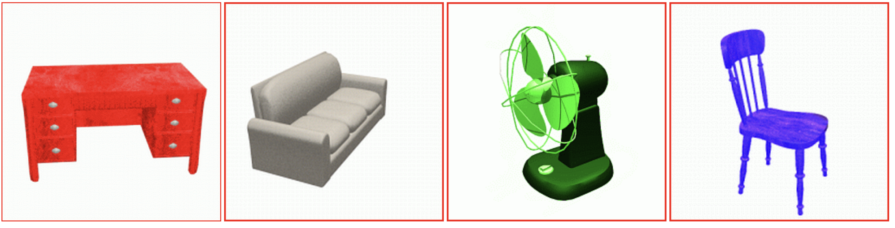
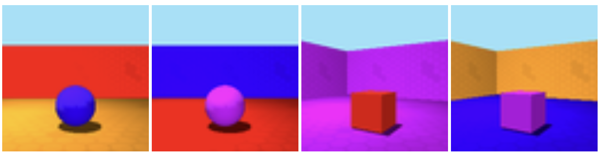
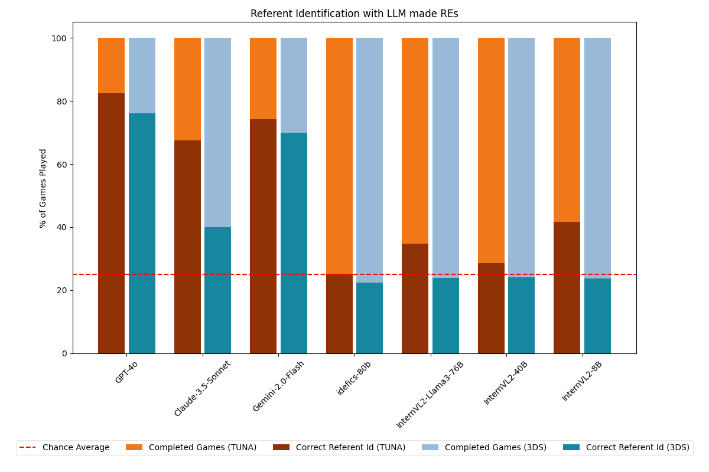
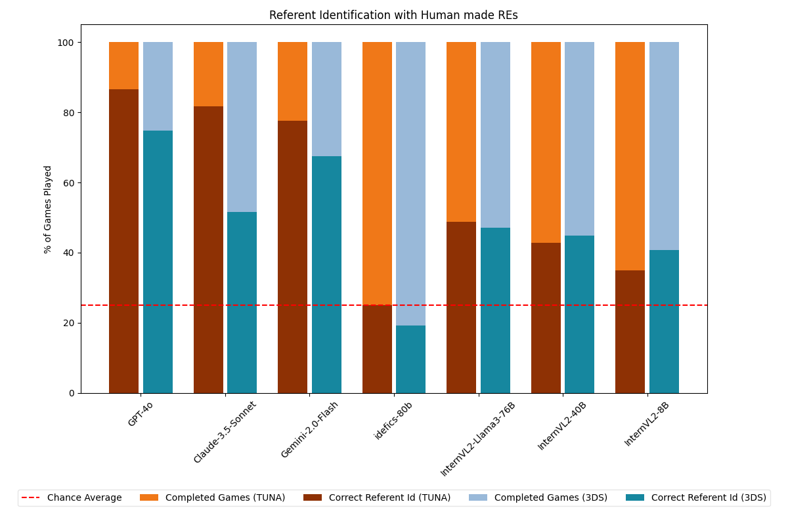
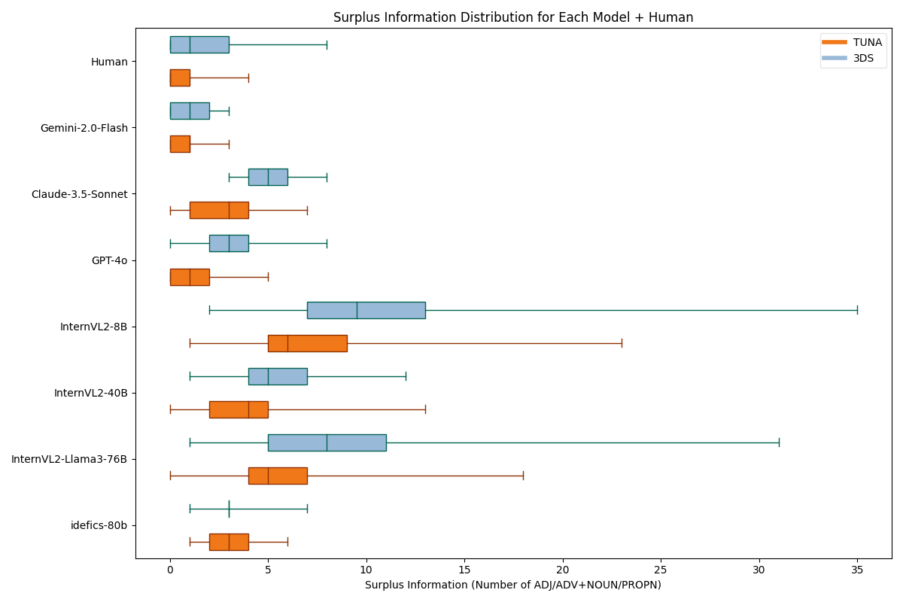

Title: Can LLMs Use Context To Describe What They See? 
Subtitle: Evaluating Multimodal LLMs through a Picture-Guessing Game
Date: 2025-04-29
Category: LLM
Tags: llm, linguistics, evaluation
Summary: How well do AI language models describe what they see? This study evaluates their ability to generate and understand referring expressions using a visual reference game.

As language models get better at understanding both text and images, I found myself wondering: **Can they actually refer to something the way we do?** Not just describe an image, but *point something out* within a controlled context clearly, like saying *“the red chair”* when there are four different chairs.

That’s what my thesis is all about. I set up a reference game, kind of like a digital version of "guess which picture I mean" and tested how well multi-modal LLMs could play it. The idea was to see whether they could understand and generate short, clear descriptions that help identify specific images while excluding the others. Here's what I found.

---

#### The Setup: A Two-Player Game

The core of the experiment was a simple two-player game:

- The **Explainer** describes a target image.
- The **Guesser** picks the right one from a set of four.

We ran this in two modes:

- **Production mode**: The model has to describe the image itself.
- **Comprehension mode**: The model is given a human-made description and has to guess the correct image.

##### The Datasets

To make things interesting, I used two types of images, one simple, one complex:

**TUNA Corpus**  
This one shows everyday furniture like chairs and desks. The objects are simple and familiar. The corpus can be found [here](https://www.abdn.ac.uk/ncs/departments/computing-science/research/overview/projects/#faq3).

*Example:*  
  
The first image is described by the attribute matrix: `<desk, red, large, front>`

**3D Shapes Dataset**  
This dataset is trickier. It has three-dimensional shapes in rooms, with more features like separate colors for the shape, floor and wall, and rotation of the room. The corpus can be found [here](https://github.com/google-deepmind/3d-shapes)

*Example:*  
  
The first image is described by the attribute matrix: `<ball, small, blue, red wall, orange floor, front>`

---

#### What I Learned

##### Models Are Better at Understanding Than Describing

Most models did a pretty good job when they were just reading a human-written description and picking an image. But when they had to **generate** that description themselves, things got messier. The descriptions were often too long or didn’t include the right details, so another LLM was not able to pick the right image based on such a description.

##### Harder Images Made Things Worse

Not surprisingly, the more complex 3D shapes caused more trouble. There were more things to describe and more ways to get it wrong.

##### Commercial Models Had the Upper Hand

Commercial models like GPT-4o and Claude 3.5 outperformed open models like InternVL2 or Idefics, especially when it came to generating clearer, more focused descriptions.

---

#### Performance Overview

Here’s an overview of how models performed in different modes on both datasets:

*Selection of correct image with LLM -ade expressions:*  

*Selection of correct image with human-made expressions:*  

In general, **comprehension mode** (expressions made by humans) led to much higher accuracy than production mode. When given a good description, models were usually able to find the right image.

---

#### A Closer Look at the Language

##### Too Much Info

One common issue was that models added too much information. Instead of just saying *"the ball"*, what would be sufficient within the given context, they’d say something like *"a small red rubber ball with a smooth surface placed in the middle of the orange-floored room with red walls."* That might sound nice, but it’s not always helpful.

*Surplus info comparison:*  

Human descriptions were much more efficient—short and to the point.

##### Visual Context *Does* Indeed Influence Language

All models have additionally been prompted to give a **ground truth** image description without the context of other images. Those descriptions exceed the picture guessing descriptions by far:
<table border="1" cellpadding="8" cellspacing="0" style="border-collapse: collapse; text-align: left; width: 100%;">
  <thead>
    <tr>
      <th style="width: 25%;">Model</th>
      <th colspan="2" style="text-align: center;">Mean Diff (TUNA)</th>
      <th colspan="2" style="text-align: center;">Mean Diff (3DS)</th>
    </tr>
    <tr>
      <th></th>
      <th style="text-align: center;">Info</th>
      <th style="text-align: center;">Length</th>
      <th style="text-align: center;">Info</th>
      <th style="text-align: center;">Length</th>
    </tr>
  </thead>
  <tbody>
    <tr>
      <td><a href="https://arxiv.org/abs/2410.21276" target="_blank">GPT-4o</a></td>
      <td><strong>14.17</strong></td>
      <td>34.81</td>
      <td><strong>18.2</strong></td>
      <td>40.8</td>
    </tr>
    <tr>
      <td><a href="https://www.anthropic.com/news/claude-3-5-sonnet" target="_blank">Claude-3.5</a></td>
      <td><strong>31.66</strong></td>
      <td>74.03</td>
      <td><strong>30.55</strong></td>
      <td>73.25</td>
    </tr>
    <tr>
      <td><a href="https://ai.google.dev/gemini-api/docs/models/experimental-models" target="_blank">Gemini-2.0</a></td>
      <td><strong>29.99</strong></td>
      <td>58.31</td>
      <td><strong>36.17</strong></td>
      <td>66.63</td>
    </tr>
    <tr>
      <td><a href="https://arxiv.org/abs/2306.16527" target="_blank">Idefics</a></td>
      <td><strong>18.07</strong></td>
      <td>49.3</td>
      <td><strong>18.23</strong></td>
      <td>45.17</td>
    </tr>
    <tr>
      <td><a href="https://arxiv.org/abs/2412.05271" target="_blank">InternVL2-Llama3-76B</a></td>
      <td><strong>30.22</strong></td>
      <td>67.89</td>
      <td><strong>26.45</strong></td>
      <td>61.96</td>
    </tr>
    <tr>
      <td><a href="https://arxiv.org/abs/2412.05271" target="_blank">InternVL2-40B</a></td>
      <td><strong>29.52</strong></td>
      <td>72.7</td>
      <td><strong>30.57</strong></td>
      <td>70.33</td>
    </tr>
    <tr>
      <td><a href="https://arxiv.org/abs/2412.05271" target="_blank">InternVL2-8B</a></td>
      <td><strong>26.33</strong></td>
      <td>60.26</td>
      <td><strong>24.29</strong></td>
      <td>58.54</td>
    </tr>
  </tbody>
</table>

  <strong>Comparison of Mean Information Difference and Mean Length Difference in Ground Truth vs. Referring Expressions.</strong> 
  (Information: Sum of included adjectives and nouns, Length: Word count) Positive values indicate more Information / word count in Ground Truth.

---

#### So, Can They Actually Do It?

##### The Good News

Yes — **LLMs can understand** referring expressions when they’re well written. Most models picked the right image when given a clear human-made description.

##### The Not-So-Good News

They’re still **not great at writing those descriptions themselves**, especially in complex scenes. The descriptions often lacked the crucial bits, or included too much unrelated info. A lot of them ended up sounding more like image captions than like purposeful, contrastive expressions.

---

#### Why This Matters

Being able to refer to things clearly is a big deal in real-world AI applications:

- Helping robots understand and follow instructions
- Making assistive tools (like screen readers) smarter
- Improving collaboration between people and machines

If a model says *“the chair in the back corner”* but there are three of them, it’s a problem. That’s why it’s important we keep testing and improving this kind of ability.

---

#### What Could Be Better?

Some ideas for future work:

- Try more human-like evaluation methods (not just minimal expressions)
- Test how models behave in **multi-turn** conversations
- See if models can be prompted or trained to use visual context more effectively
- Fix inconsistent outputs; models often gave different answers for the same input

---

#### Final Thoughts

Language models are clearly getting better at handling vision and language together. But this kind of **reference-focused task** is still tricky. Most models do fine reading descriptions, but struggle to produce their own that are short, clear, and helpful.

Still, the gap is closing and this kind of research helps us understand where the real challenges are.

Want to dig deeper?  
**[Read the full thesis (PDF)](https://drive.google.com/file/d/1cqocdQEf3c_h90fOwwvgsSTZ18eBanKJ/view?usp=sharing)**